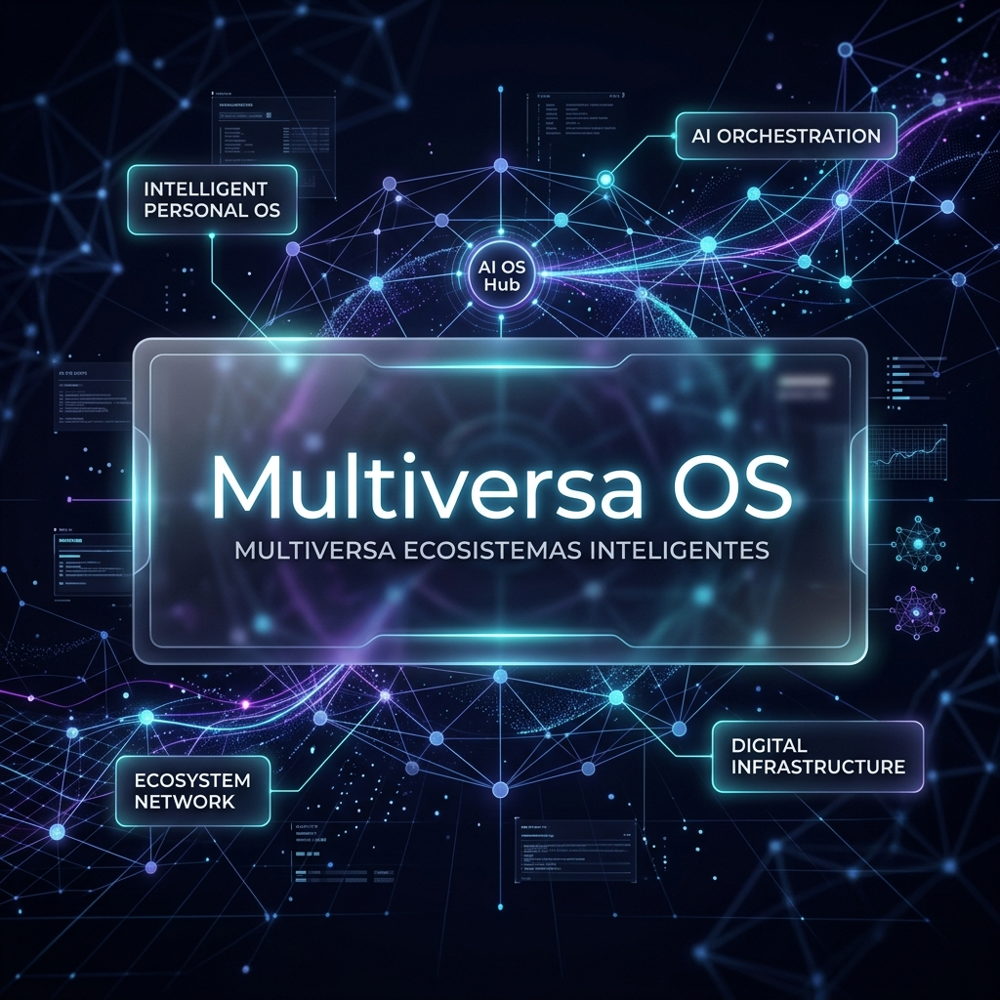

<div align="center">
  
  
  # Multiversa OS
  **Ecosistemas Inteligentes & Orquestación Universal Humano+IA**
</div>

## 🌐 Visión General

Multiversa OS no es solo un asistente de código, es un **Sistema Operativo Inteligente Personal**. A través de una arquitectura agnóstica multiplataforma, unifica el contexto, la memoria y las habilidades de Inteligencia Artificial para que te sigan a cualquier entorno de desarrollo (IDE) o interfaz conversacional.

### Pilares Fundamentales
1. **Contexto Compartido Universal:** Sincronización de estado en tiempo real. Tu ecosistema es el mismo en Cursor, Claude Code, Gemini, etc.
2. **Memoria Persistente (Engram):** Aprendizaje continuo y registro de decisiones arquitectónicas.
3. **Mapeo de Conocimiento (Graphify):** Ingestión de proyectos completos a través de grafos semánticos.
4. **Disciplina Operativa (Gentle SDD):** Spec-Driven Development (desarrollo impulsado por especificaciones) para garantizar calidad antes de escribir una línea de código.
5. **Simulación (MiroFish):** Pruebas de escenarios pre-lanzamiento.

## 🚀 Instalación Rápida (Multiversa Lab)

Este repositorio contiene el `multiversa-installer.sh`, el cual inicializa el entorno `~/.multiversa` en tu sistema local (Mac, Linux, WSL).

```bash
chmod +x multiversa-installer.sh
./multiversa-installer.sh
```

El instalador te guiará de manera interactiva para definir tu rol y configurar tu entorno bajo el ecosistema "Lab" (Open Source) o "Ecosistemas Inteligentes" (Tier avanzado).

## 🗂 Estructura de Proyecto Inicial
- `/templates`: Archivos de configuración pre-establecidos para Engram, Graphify y Gentle AI.
- `/projects`: Zona de orquestación donde se inicializan nuevos clientes o desarrollos (Ej: `cintia-larizzati`).

---
*Diseñado bajo los estándares premium de **Multiversa Ecosistemas Inteligentes**.*
*"Humano + IA, escalando el infinito."*
