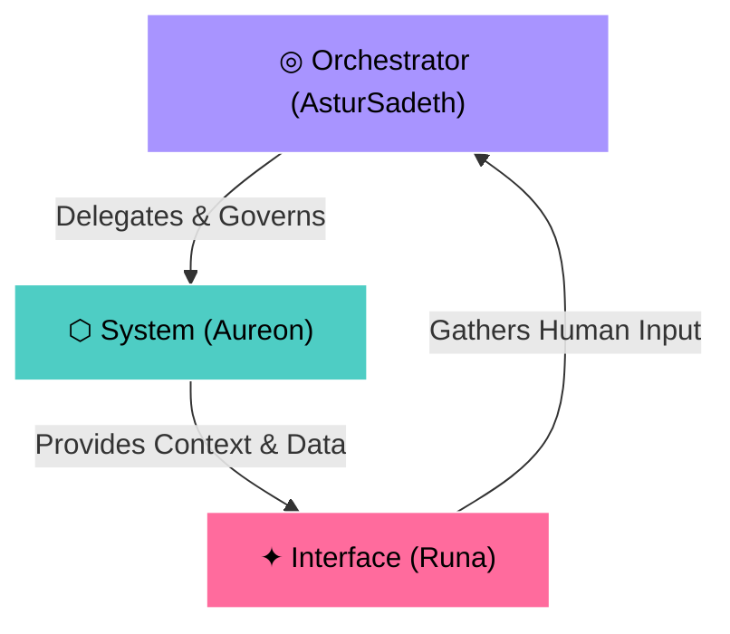

# Multiversa Lab — Architecture: Triad Protocol

Welcome to the technical foundation of **Multiversa Lab**. This document outlines the core agent orchestration architecture, known as the **Triad Protocol**, which powers our Intelligent Personal OS.

---

## The Triad Protocol (◎ ⬡ ✦)

Agent-based orchestration shouldn't be a monolithic loop. Multiversa structures agent interactions into three distinct, specialized entities. Each has its own role, boundary, and memory spine:

### 1. ◎ The Orchestrator (AsturSadeth)
- **Primary Color:** Violet (`#a894ff`)
- **Responsibility:** Decisions, logic, routing, and task decomposition.
- **Role:** AsturSadeth is the senior planner. It reviews constraints, decomposes complex requirements into atomic execution phases, and directs the other subagents.

### 2. ⬡ The System (Aureon)
- **Primary Color:** Teal (`#4ecdc4`)
- **Responsibility:** Infrastructure, execution, file manipulation, and database access.
- **Role:** Aureon acts as the worker engine. It builds packages, manages file reads/writes, queries the database, and executes tests. It only runs under the governance of the Orchestrator.

### 3. ✦ The Interface (Runa)
- **Primary Color:** Rose (`#ff6b9d`)
- **Responsibility:** Interaction, presentation, human feedback, and UI rendering.
- **Role:** Runa bridges the gap between the internal state graph and the human operator. It displays progress, renders interactive tools (like status boards), and prompts for decisions when ambiguity arises.

---

## Architecture Separation: Lab vs Group

To guarantee intellectual and physical integrity, Multiversa operates on two parallel planes:

| Property | Multiversa Lab (This Repo) | Multiversa Group |
|:---|:---|:---|
| **Purpose** | Open-source core engine and R&D. | Closed-source commercial implementation. |
| **Codebase** | Public, collaborative, and MIT licensed. | Private, proprietary, and under NDAs. |
| **Ecosystem** | Local-first, developer-centric. | Cloud-native, scaled enterprise platforms. |
| **Philosophy** | *AI proposes, human decides.* | *Continuity, security, and performance.* |

---

## Directory Hierarchy & Foundation

The `multiversalab` repository is organized as follows:
- `/docs`: Markdown specification documents (this folder).
- `/landing`: SvelteKit frontend landing page and dashboard.
- `/templates`: Structure templates for Engram, Graphify, and Gentle stacks.
- `/projects`: Local execution sandboxes for active project developments.
